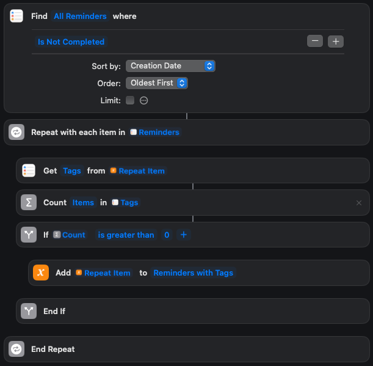
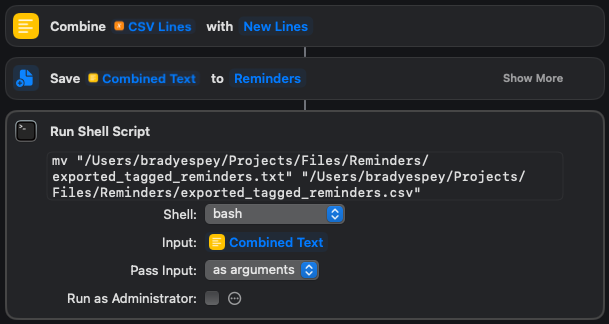
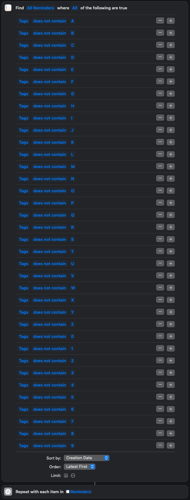
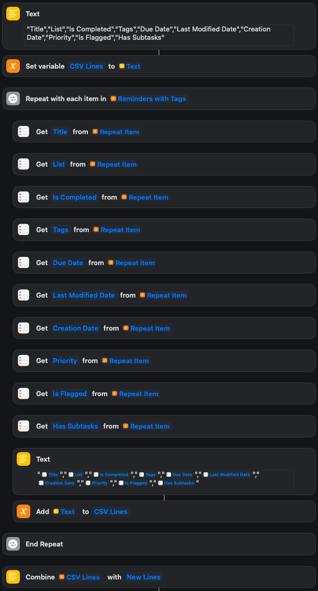
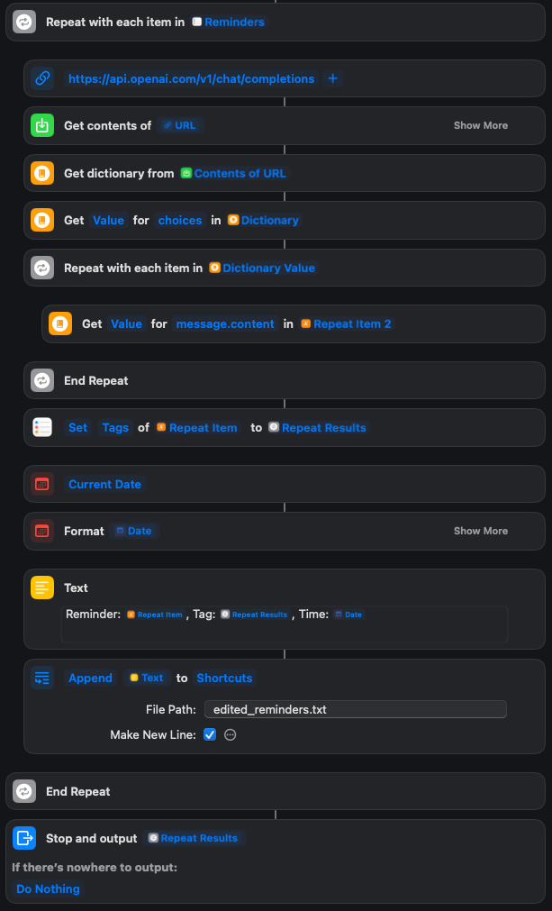

# SmartTagGPT:
# Automating Reminder Tagging with a Fine-Tuned GPT Model

## Overview

**SmartTagGPT** is a project that automates the tedious task of tagging reminders in Apple Reminders using a GPT model, with an option to fine-tune the model for more personalized tag suggestions. By fine-tuning the model on your personal reminder data, you can improve the accuracy of the suggested tags, making the system more tailored to your specific needs.

This project consists of three main parts:

1. **Exporting tagged reminders to CSV** using Apple Shortcuts, which prepares the data for fine-tuning.
2. **Preparing the fine-tuning model** with a JSONL file generated from the exported reminders. This step fine-tunes GPT to match your reminder tagging preferences.
3. **Creating a Shortcut automation** that runs every hour to tag untagged reminders using either the fine-tuned GPT model or the base GPT-3.5-turbo model.

If you don’t want to fine-tune the model, you can skip the second step and directly automate the tagging using the base ChatGPT model.

## Features
- **Personalized Reminder Tagging**: Fine-tune GPT on your personal reminder data for better tag suggestions.
- **Automated Tagging**: Automatically tags untagged reminders every hour using the OpenAI API.
- **Flexible Configuration**: Choose between using the base GPT model or a fine-tuned model.

## Prerequisites
Before starting, ensure you have access to the OpenAI API and have your API key ready. You will also need:
- **Apple Shortcuts**: To export and automate reminder tagging.
- **Python**: To run the scripts for converting data and fine-tuning the model.
- **[OpenAI API Key](https://platform.openai.com/signup)**: Store securely in your project files as described below.

## Project Workflow

### 1. Exporting Tagged Reminders to CSV Using Apple Shortcuts

This step exports your reminders with their tags into a CSV file, which can later be used to fine-tune the GPT model.

#### Shortcut Workflow
1. Find reminders with tags using the **Apple Shortcuts** app.

2. Export these reminders to a `.csv` file.


The exported file will be saved as `exported_tagged_reminders.csv` in a location you specify.

---

### 2. Converting CSV to JSONL for Fine-Tuning

Once your reminders have been exported to CSV, you need to convert the file into JSONL format to prepare it for fine-tuning with GPT.

#### Steps:
1. Locate the exported CSV (`exported_tagged_reminders.csv`).
2. Run the `convert_csv_to_jsonl.py` script to generate the JSONL file:
   ```bash
   python convert_csv_to_jsonl.py
   ```
3. This will output a `fine_tune_dataset.jsonl` file that contains the reminder titles and their respective tags, formatted for fine-tuning.

#### Example JSONL Entry:
```json
{"messages": [{"role": "user", "content": "Reminder Title"}, {"role": "assistant", "content": "#Tag"}]}
```

---

### 3. Fine-Tuning a GPT Model with Tagged Reminders

Fine-tuning GPT will help you achieve more accurate tag suggestions, aligning with your personal tagging habits.

#### Fine-Tuning Steps:
1. Upload your dataset by running the `fine_tuning.py` script:
   ```bash
   python fine_tuning.py
   ```
   - This uploads the `fine_tune_dataset.jsonl` file to OpenAI and starts the fine-tuning process.
2. Monitor the status of the fine-tuning job using the `check_fine_tune_status.py` script:
   ```bash
   python check_fine_tune_status.py
   ```
   - The script will output the job status and notify you once the fine-tuning is complete.

> **Note:** Fine-tuning is optional. If you choose to skip this step, you can use the base GPT model in the next step.

---

### 4. Automatically Tagging Untagged Reminders Using the Fine-Tuned Model

Once fine-tuning is complete (or if you're using the base model), create an Apple Shortcut to automatically tag untagged reminders.

#### Shortcut Workflow:
1. Find reminders without tags using **Apple Shortcuts**:

   
2. Send these reminders to the GPT model (either fine-tuned or base) for tag suggestions.


3. Automatically tag the reminders with the suggested tag:


#### Automation:
You can schedule this Shortcut to run every hour using `crontab`. Here’s how to automate it:

1. Open the terminal and edit your `crontab` file:
   ```bash
   crontab -e
   ```

2. Add the following line to schedule the Shortcut to run every hour:
   ```bash
   0 * * * * /usr/bin/shortcuts run "Add Tags to Reminders"
   ```

---

## Screenshots of the Workflow

1. **Find Tagged Reminders**  
   

2. **Export Tagged Reminders**  
   

3. **Find Untagged Reminders**  
   

4. **Prepare Tagged Reminders**  
   

5. **Tag Untagged Reminders**  
   

---

## Setting Up the API Key and Model

Before running the Python scripts, you will need to store your OpenAI API key and fine-tuning job/model information in secure JSON files.

### API Key
1. Create a file named `openai_api_key.json` in `/Users/bradyespey/Projects/Files/Reminders/`.
2. Add your API key to the file:
   ```json
   {
     "api_key": "your-openai-api-key"
   }
   ```

### Model ID
1. Create a file named `openai_model_id.json` if you're using a fine-tuned model:
   ```json
   {
     "model_id": "ft:gpt-3.5-turbo-0125:michael-house::B7hT2kXQ"
   }
   ```

### Fine-Tuning Job ID
1. If you want to check the fine-tuning job status, create a file named `openai_job_id.json`:
   ```json
   {
     "job_id": "ftjob-X9vP3L7QmkH8RbJyT4Zn1cKD"
   }
   ```

---

## Conclusion

This project offers a highly customizable approach to automating the tagging of reminders in Apple Reminders. By leveraging a fine-tuned GPT model, **SmartTagGPT** improves the accuracy of tag suggestions, making your reminder organization more efficient and personalized. You can either fine-tune the model for your own use case or use the base GPT model to get started right away.

---

### Helpful Links
- [OpenAI API Documentation](https://beta.openai.com/docs/)
- [Create OpenAI API Key](https://platform.openai.com/signup)